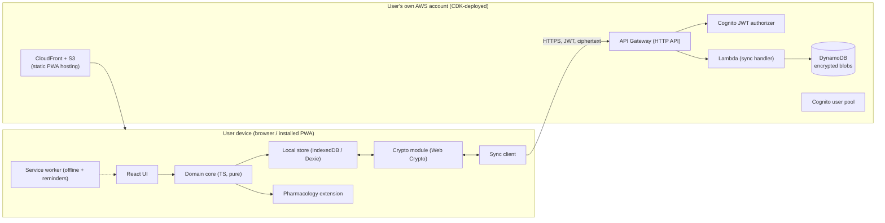

# SteadyDose — Architecture Document

| | |
|---|---|
| **Working name** | SteadyDose |
| **Status** | Draft for build |
| **Related** | `01-prd.md`, `03-implementation-plan.md`, `specs/*` |

---

## 1. Summary
SteadyDose is a **local-first, end-to-end-encrypted Progressive Web App**. The browser holds the source of truth (IndexedDB) and works fully offline. Data is encrypted on-device and synced as opaque ciphertext to a **per-user AWS backend that the user owns and deploys themselves** via infrastructure-as-code. The app manages medications, a fixed grouped daily schedule, dose logging (including adjusted doses for late doses), safety guardrails, history, adherence, and reminders. **It computes no pharmacology**; the user's equations plug into a single interface.

## 2. Architectural principles
1. **Local-first.** The client is authoritative and offline-capable; the cloud is sync + backup.
2. **Zero-knowledge cloud.** The server stores only ciphertext; keys never leave the device.
3. **Data sovereignty.** One user, one AWS account, one deployment. No shared backend.
4. **Pluggable pharmacology.** Dose adjustment is an interface, not a built-in.
5. **Safety by construction.** The app records and validates doses; it never originates a dose value. Caps are enforced centrally.
6. **Boring, cheap infrastructure.** Serverless, pay-per-use, standard AWS primitives, easy to deploy and tear down.

## 3. High-level diagram



ASCII fallback: UI → pure domain core → IndexedDB; crypto wraps records before the sync client sends them over HTTPS (JWT-authorised) to API Gateway → Lambda → DynamoDB. Static assets served from S3 via CloudFront. All AWS resources live in the user's account and are created by a CDK stack.

## 4. Components
- **React UI** — presentation only; binds to the domain core via a thin store (Zustand). No business logic.
- **Domain core (pure TypeScript)** — entities, scheduling/enumeration, guardrail validation, timezone math, adherence. Framework-agnostic and unit-tested in isolation. This is the heart and is portable.
- **Local store** — IndexedDB via Dexie; repository interface; tracks per-record `updatedAt`, `version`, and `deleted` for sync.
- **Crypto module** — Web Crypto API; envelope encryption; key derivation and recovery.
- **Sync client** — pull/push protocol against the API; offline queue; conflict resolution.
- **Pharmacology extension** — implements `DoseAdjustmentStrategy`; default is a no-op returning `null`.
- **Service worker** — offline asset/data caching and notification scheduling.
- **AWS stack (CDK)** — Cognito, API Gateway HTTP API, Lambda, DynamoDB, S3 + CloudFront.

## 5. Data model (canonical TypeScript)
```ts
type ISODate = string;        // "YYYY-MM-DD"
type WallTime = string;       // "HH:MM" 24h
type Instant = number;        // epoch ms (UTC)
type IanaZone = string;       // e.g. "Europe/London"

interface Guardrails {
  maxSingleDose: number | null;
  maxDailyDose: number | null;
  minIntervalHours: number | null;
}

interface Medication {
  id: string;
  name: string;
  color: string;              // hex
  unit: string;               // e.g. "mg"
  halfLifeHours: number;      // stored for the user's equations
  adjustWhenLate: boolean;    // timing-sensitive vs flexible
  active: boolean;
  notes?: string;
  guardrails: Guardrails;
  updatedAt: Instant;
  deleted?: boolean;
}

interface ScheduleItem { medId: string; dose: number; }

interface Slot {
  id: string;
  time: WallTime;             // wall-clock, resolved in current zone
  label?: string;
  items: ScheduleItem[];      // the group; >= 1
  updatedAt: Instant;
  deleted?: boolean;
}

interface DoseLogEntry {
  id: string;
  slotId: string;
  medId: string;
  scheduledInstant: Instant;
  actualInstant: Instant;
  dose: number;               // actual amount taken (may be adjusted)
  unit: string;
  zone: IanaZone;             // zone in effect when taken
  status: "taken" | "skipped";
  adjusted: boolean;          // dose !== scheduled dose
  warnings: string[];         // guardrail messages at log time
  updatedAt: Instant;
  deleted?: boolean;
}

interface Settings {
  zone: IanaZone;
  adherenceWindowDays: number;
  missedDayThreshold: number;
  updatedAt: Instant;
}
```
Each syncable record carries `id`, `updatedAt`, optional `deleted`, and an implicit `version`.

## 6. Time & timezone model
- **Storage:** every event is an absolute `Instant` (UTC). Pharmacokinetics depend on real elapsed time, which is timezone-invariant.
- **Schedule resolution:** wall-clock `Slot.time` → `Instant` in the user's **current** zone via a two-pass offset calculation (handles DST boundaries). Same med across zones therefore shifts in absolute time — which is exactly the perturbation an adjusted dose corrects.
- **Display:** `Intl.DateTimeFormat` with `timeZone`; short name yields correct **GMT/BST**.
- **Flights:** changing the active zone re-resolves the schedule; the real inter-dose interval changes accordingly.
- **Known refinement (Stage 5):** matching a logged dose to its slot occurrence is by `(slotId, medId, scheduledInstant)`. Across a mid-day zone change this becomes approximate; tighten with a tolerance window / occurrence key.

## 7. Encryption design (E2E, zero-knowledge)
Default decision: **end-to-end encryption**, chosen for the data-rights priority. Server-side-only encryption is the documented simpler alternative (loses zero-knowledge, gains easy recovery).

- **Algorithms:** AES-GCM-256 for record payloads; key derivation Argon2id (or PBKDF2-SHA-256 as a Web-Crypto-native fallback) from the user passphrase.
- **Key hierarchy (envelope):**
  - Passphrase → **Key-Encryption-Key (KEK)** via KDF (per-user salt).
  - Random **Data-Encryption-Key (DEK)** encrypts records.
  - DEK is wrapped by KEK and stored (wrapped) locally and in the cloud. Server sees only the wrapped DEK and ciphertext.
- **Recovery:** at setup, generate a high-entropy **recovery code**; wrap the DEK a second time with a recovery-code-derived key. Losing both passphrase and recovery code = unrecoverable (surfaced explicitly). Optional encrypted export as belt-and-suspenders.
- **What the server can see:** record `id`, `userId`, `updatedAt`, `deleted`, size, ciphertext. No plaintext, no field names.
- **Rotation:** passphrase change re-wraps the DEK only (no re-encrypt of data).

## 8. Sync protocol
Local-first, single-user, multi-device. Records are opaque ciphertext envelopes.

- **Envelope (server-stored):** `{ userId, id, updatedAt, version, deleted, ciphertext }`.
- **Endpoints (JWT-authorised):**
  - `POST /sync/pull` → `{ since: token }` ⇒ changed envelopes + new token.
  - `POST /sync/push` → `{ changes: envelope[] }` ⇒ accepted/rejected per id.
- **Change tracking:** client keeps `lastSyncToken` (high-water `updatedAt`/sequence). DynamoDB items keyed `PK=userId`, `SK=recordId`, with a GSI on `updatedAt` for incremental pulls.
- **Conflict resolution:** **last-write-wins by `updatedAt`** per record (conflicts are rare for one user); `deleted` tombstones win ties toward deletion-safety only if newer. Hybrid logical clock is a future option if needed.
- **Idempotency & resumability:** push is idempotent on `(id, version)`; interrupted syncs resume from `lastSyncToken`. Offline edits queue and replay.

## 9. AWS infrastructure (CDK, TypeScript)
All resources in the **user's own account**, one stack, `cdk deploy`.

| Resource | Purpose |
|---|---|
| Cognito User Pool (+ app client) | Per-user auth, JWT issuance |
| API Gateway **HTTP API** | `/sync/*` endpoints, JWT authorizer |
| Lambda (Node/TS) | Sync handler; reads/writes DynamoDB |
| DynamoDB table | Encrypted envelopes; on-demand billing; PITR on; SSE-KMS at rest |
| S3 + CloudFront | Static PWA hosting (private bucket, OAC) |
| KMS key | DynamoDB at-rest (defence-in-depth atop E2E) |

Alternative: **Amplify Gen 2** (higher-level, faster scaffold, less control). Trade-off recorded; CDK chosen for transparency and clean BYO-account deploys in an open-source context.

## 10. Security model
- **Threat posture:** cloud provider / DB compromise yields only ciphertext. Device compromise is out of scope of E2E (standard limitation).
- **Transport:** HTTPS only; JWT (Cognito) on every API call; authorizer enforces user isolation by `userId` claim.
- **IAM:** least-privilege Lambda role (single-table access). Deploy uses the operator's own short-lived/SSO creds — never committed, never in prompts.
- **No telemetry** leaves the account by default.
- **Safety guardrails** are enforced in the domain core before any write and surfaced in UI.

## 11. Pharmacology extension interface
```ts
interface AdjustmentContext {
  med: Medication;
  scheduledInstant: Instant;
  actualInstant: Instant;     // when the user is logging
  recentDoses: DoseLogEntry[];// prior taken doses for this med
}

interface AdjustmentResult {
  suggestedDose: number;      // in med.unit
  rationale?: string;
}

interface DoseAdjustmentStrategy {
  computeAdjustment(ctx: AdjustmentContext): AdjustmentResult | null;
}
```
- Default implementation returns `null` (no suggestion).
- Any returned `suggestedDose` is passed through the **same guardrail validator** before being offered.
- Self-hosters replace the strategy module with their own equations; no other code changes required.

## 12. Tech stack & alternatives
| Area | Choice | Alternative considered |
|---|---|---|
| Client | React + TypeScript + Vite, PWA (Workbox) | SvelteKit |
| Styling | Tailwind | CSS modules |
| Local DB | IndexedDB via Dexie | RxDB (heavier, built-in replication) |
| State binding | Zustand | Redux Toolkit |
| Crypto | Web Crypto (AES-GCM, Argon2id/PBKDF2) | libsodium-wrappers |
| IaC | AWS CDK (TS) | Amplify Gen 2 |
| API | API Gateway HTTP API + Lambda | AppSync (GraphQL) |
| Data | DynamoDB single-table | DynamoDB + per-type tables |
| Hosting | S3 + CloudFront | Amplify Hosting |

## 13. Deployment (bring-your-own-AWS)
1. Operator authenticates AWS locally (SSO / named profile; short-lived creds).
2. `cdk bootstrap` (first time) then `cdk deploy` provisions the stack.
3. Build the PWA, sync assets to S3, invalidate CloudFront.
4. Configure the app with the deployed Cognito/API IDs (generated config).
5. Create the user, set passphrase, store recovery code.
Teardown: `cdk destroy` removes everything. Export first if retaining data.

## 14. Observability & cost
- CloudWatch logs/metrics for the Lambda and API (within the user's account).
- Idle cost ≈ \$0; pay-per-request DynamoDB and Lambda; CloudFront/S3 negligible for one user.
- No external services; nothing to bill beyond AWS usage.
