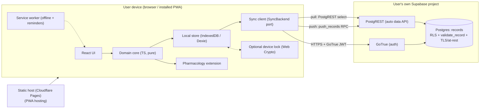

# SteadyDose — Architecture Document

| | |
|---|---|
| **Working name** | SteadyDose |
| **Status** | Draft for build |
| **Related** | `01-prd.md`, `03-implementation-plan.md`, `specs/*` |

> **Re-platformed onto Supabase (Stage 8).** This document originally described a
> bring-your-own-**AWS** backend (Cognito + API Gateway + Lambda + DynamoDB +
> S3/CloudFront + KMS, via CDK). Stage 8 replaced that whole tier with **Supabase**
> (GoTrue + Postgres + RLS + PostgREST) and collapsed the custom sync API — see
> `specs/stage-8-supabase-migration.md` and `supabase/README.md`. The functional
> contract (per-user, auth-protected, server-readable records synced bidirectionally
> with last-write-wins) is unchanged. Sections below are updated for Supabase; the
> deliberate **"server-readable, not zero-knowledge"** decision still holds —
> Postgres rows are server-readable by design.

---

## 1. Summary
SteadyDose is a **local-first, offline-capable Progressive Web App** with a
**secure, server-readable cloud**. The browser holds the source of truth
(IndexedDB) and works fully offline. Data syncs as **readable, structured records**
to a **per-user Supabase backend** (one Postgres `records` table) that the user
owns. The backend is **not zero-knowledge**: it can read and
operate on the data (enabling future server-side features), and is secured by
transport encryption (TLS), strong auth (GoTrue), per-user authorization
(Row-Level Security), and encryption at rest.
The app manages medications, a fixed grouped daily schedule, dose logging
(including adjusted doses for late doses), safety guardrails, history, adherence,
and reminders. **It computes no pharmacology**; the user's equations plug into a
single interface.

## 2. Architectural principles
1. **Local-first.** The client is authoritative and offline-capable; the cloud is sync + backup.
2. **Secure, server-readable cloud.** The backend stores readable, structured data (not zero-knowledge) so it can validate it and later power server-side features (reporting, reminders, sharing, backup); the dose math stays on-device. Security comes from TLS, strong auth, per-user authorization, and encryption at rest.
3. **Data sovereignty.** One user, one Supabase project, one deployment. No shared backend.
4. **Pluggable pharmacology.** Dose adjustment is an interface, not a built-in.
5. **Safety by construction.** The app records and validates doses; it never originates a dose value. Caps are enforced centrally.
6. **Boring, cheap infrastructure.** Managed Postgres + auth; per-user isolation and conditional writes are native (RLS + SQL), so there is almost no server code to own.

## 3. High-level diagram



ASCII fallback: UI → pure domain core → IndexedDB; the sync client implements a `SyncBackend` port — **pull** is a direct PostgREST select (RLS scopes it to the caller) and **push** is the `push_records` Postgres RPC (LWW version guard + `validate_record` in SQL). The GoTrue JWT authenticates every call; `auth.uid()` drives RLS. Static assets are served from a static host (Cloudflare Pages by default). All resources live in the user's own Supabase project; the schema is applied by `supabase db push`.

## 4. Components
- **React UI** — presentation only; binds to the domain core via a thin store (Zustand). No business logic.
- **Domain core (pure TypeScript)** — entities, scheduling/enumeration, guardrail validation, timezone math, adherence. Framework-agnostic and unit-tested in isolation. This is the heart and is portable.
- **Local store** — IndexedDB via Dexie; repository interface; tracks per-record `updatedAt`, `version`, and `deleted` for sync.
- **Crypto module (optional)** — Web Crypto API; an **optional on-device lock** that encrypts the local cache at rest (convenience defense, not zero-knowledge). Disabled by default.
- **Sync client** — implements the `SyncBackend` port (`src/sync/supabaseBackend.ts`): pull via a PostgREST select, push via the `push_records` RPC; offline queue and LWW conflict resolution live in the storage-agnostic sync engine above it.
- **Pharmacology extension** — implements `DoseAdjustmentStrategy`; default is a no-op returning `null`.
- **Service worker** — offline asset/data caching and notification scheduling.
- **Supabase backend** — GoTrue (auth), Postgres (one `records` table + RLS + `push_records`/`validate_record`), PostgREST (the data API). Schema lives in `supabase/migrations/`; no custom server runtime to own.

## 5. Data model (canonical TypeScript)
```ts
type ISODate = string;        // "YYYY-MM-DD"
type WallTime = string;       // "HH:MM" 24h
type Instant = number;        // epoch ms (UTC)
type IanaZone = string;       // e.g. "Europe/London"

interface Guardrails {
  maxSingleDose: number | null;
  maxDailyDose: number | null;
  minIntervalHours: number | null;
}

interface Medication {
  id: string;
  name: string;
  color: string;              // hex
  unit: string;               // e.g. "mg"
  halfLifeHours: number;      // stored for the user's equations
  adjustWhenLate: boolean;    // timing-sensitive vs flexible
  active: boolean;
  notes?: string;
  guardrails: Guardrails;
  updatedAt: Instant;
  deleted?: boolean;
}

interface ScheduleItem { medId: string; dose: number; }

interface Slot {
  id: string;
  time: WallTime;             // wall-clock, resolved in current zone
  label?: string;
  items: ScheduleItem[];      // the group; >= 1
  updatedAt: Instant;
  deleted?: boolean;
}

interface DoseLogEntry {
  id: string;
  slotId: string;
  medId: string;
  scheduledInstant: Instant;
  actualInstant: Instant;
  dose: number;               // actual amount taken (may be adjusted)
  unit: string;
  zone: IanaZone;             // zone in effect when taken
  status: "taken" | "skipped";
  adjusted: boolean;          // dose !== scheduled dose
  warnings: string[];         // guardrail messages at log time
  updatedAt: Instant;
  deleted?: boolean;
}

interface Settings {
  zone: IanaZone;
  adherenceWindowDays: number;
  missedDayThreshold: number;
  updatedAt: Instant;
}
```
Each syncable record carries `id`, `updatedAt`, optional `deleted`, and an implicit `version`.

## 6. Time & timezone model
- **Storage:** every event is an absolute `Instant` (UTC). Pharmacokinetics depend on real elapsed time, which is timezone-invariant.
- **Schedule resolution:** wall-clock `Slot.time` → `Instant` in the user's **current** zone via a two-pass offset calculation (handles DST boundaries). Same med across zones therefore shifts in absolute time — which is exactly the perturbation an adjusted dose corrects.
- **Display:** `Intl.DateTimeFormat` with `timeZone`; short name yields correct **GMT/BST**.
- **Flights:** changing the active zone re-resolves the schedule; the real inter-dose interval changes accordingly.
- **Known refinement (Stage 5):** matching a logged dose to its slot occurrence is by `(slotId, medId, scheduledInstant)`. Across a mid-day zone change this becomes approximate; tighten with a tolerance window / occurrence key.

## 7. Security & data-protection design (server-readable, not zero-knowledge)
Default decision: the cloud stores **readable, structured data** so the backend
can validate it and, later, build server-side features (analytics/reporting,
server-driven reminders/push, clinician sharing, richer backup). Zero-knowledge /
end-to-end encryption was considered and **rejected** as it would block those
server-side features and complicate recovery. **Pharmacology / blood-level
calculation stays on-device** — it is simple and runs in the extension (§11); the
readable cloud is about validation, sync, and future server features, not about
moving the dose math server-side. Protection is layered, not key-custody-based:

- **In transit:** HTTPS/TLS only; GoTrue JWT on every PostgREST/RPC call.
- **At rest:** Supabase-managed Postgres encryption at rest; managed backups (per Supabase plan).
- **Authentication:** GoTrue — email/password, configurable password policy, optional MFA, short access-token TTL with automatic refresh; sign-out clears tokens.
- **Authorization:** per-user isolation enforced **in the database** by Row-Level Security — every policy is `user_id = auth.uid()`, where `auth.uid()` comes from the verified JWT. The owner is never trusted from the request body, and this holds for both PostgREST selects and the push RPC.
- **Server-side validation:** the `push_records` RPC runs `validate_record` (a plpgsql mirror of the shared TS schema) before persist, plus the `payload_size` check constraint and the `record_type` enum; malformed/oversized/unknown-type writes are rejected per-id.
- **Optional on-device lock:** a passphrase/WebAuthn-gated key may encrypt the **local cache** at rest (Web Crypto AES-GCM) as a convenience defense for a shared/lost device — not zero-knowledge, disabled by default.
- **What the server can see:** everything — `user_id`, record `id`, `type`, `updated_at`, `deleted`, and the readable `payload`. This is by design.
- **Recovery:** account recovery via GoTrue (email reset). No cryptographic recovery code; losing a passphrase does not lose the cloud data.

## 8. Sync protocol
Local-first, single-user, multi-device. Records are **readable structured envelopes** the server validates.

- **Envelope (server-stored):** the `records` table row `{ user_id, id, type, updated_at, version, deleted, payload }` — `payload` is a readable `jsonb`, typed by `type`.
- **Operations (GoTrue-authorised; the client implements `SyncBackend`):**
  - **pull** — a PostgREST select: `from('records').gt('updated_at', since).order('updated_at')`; RLS scopes it to the caller. The client computes the new high-water token (max `updated_at`, floored at `since`).
  - **push** — the `push_records(changes jsonb)` RPC ⇒ a per-id verdict `{ id, accepted, reason }` (validation/stale reasons), so one bad record doesn't sink the batch.
- **Change tracking:** client keeps `lastSyncToken` (high-water `updated_at`). The `records_by_updated_at` index serves incremental pulls; `type` is a plain column (a `where type = …`, replacing the old `byType` GSI).
- **Conflict resolution:** **last-write-wins on `(updated_at, version)`** per record, enforced by the SQL guard in `push_records` and by `isNewerRecord` on the client (the same predicate on both ends); `deleted` tombstones propagate as records.
- **Idempotency & resumability:** push is idempotent on `(id, version)` (re-pushing the same record loses the LWW guard and is reported stale); interrupted syncs resume from `lastSyncToken`. Offline edits queue and replay.

## 9. Supabase backend
All resources in the **user's own Supabase project**; the schema is one migration, applied with `supabase db push`.

| Resource | Purpose |
|---|---|
| GoTrue (auth) | Per-user auth, JWT issuance, refresh |
| Postgres `records` table | Readable structured records; `primary key (user_id, id)`; `records_by_updated_at` index; `payload_size` check |
| Row-Level Security | Per-user isolation (`user_id = auth.uid()`) on every path |
| `push_records` RPC | LWW version guard + per-record validation in SQL |
| `validate_record` (plpgsql) | Server-side schema validation mirroring the shared TS rules |
| PostgREST | Auto-generated data API (pull select + RPC call) |
| Static host (Cloudflare Pages) | Static PWA hosting (CDN, HTTPS, custom domains) |

The custom API tier (API Gateway + Lambda + handler-core) and the IaC stack (CDK) are gone: Postgres + RLS provide isolation and conditional writes natively, so the server shrinks to one table, one policy set, and one function.

## 10. Security model
- **Threat posture:** the cloud is **not zero-knowledge** — a DB compromise *within the user's own Supabase project* would expose readable medication data. This is the accepted trade-off for a server-usable backend; the blast radius is bounded to one user, mitigated by RLS, encryption at rest, and optional MFA. The optional on-device lock limits exposure of the **local** cache on a shared/lost device.
- **Transport:** HTTPS only; GoTrue JWT on every PostgREST/RPC call; RLS enforces user isolation by the JWT's `sub` (`auth.uid()`).
- **Keys:** only the **publishable anon key** ships in the client (it grants no data access on its own — RLS does the gating). The **service-role key bypasses RLS** and is never shipped or committed.
- **No telemetry** leaves the project by default.
- **Safety guardrails** are enforced in the domain core before any write and surfaced in UI.

## 11. Pharmacology extension interface
```ts
interface AdjustmentContext {
  med: Medication;
  scheduledInstant: Instant;
  actualInstant: Instant;     // when the user is logging
  recentDoses: DoseLogEntry[];// prior taken doses for this med
}

interface AdjustmentResult {
  suggestedDose: number;      // in med.unit
  rationale?: string;
}

interface DoseAdjustmentStrategy {
  computeAdjustment(ctx: AdjustmentContext): AdjustmentResult | null;
}
```
- Default implementation returns `null` (no suggestion).
- Any returned `suggestedDose` is passed through the **same guardrail validator** before being offered.
- Self-hosters replace the strategy module with their own equations; no other code changes required.

## 12. Tech stack & alternatives
| Area | Choice | Alternative considered |
|---|---|---|
| Client | React + TypeScript + Vite, PWA (Workbox) | SvelteKit |
| Styling | Tailwind | CSS modules |
| Local DB | IndexedDB via Dexie | RxDB (heavier, built-in replication) |
| State binding | Zustand | Redux Toolkit |
| Auth | Supabase GoTrue (password policy, optional MFA, JWT) | Auth0 / self-hosted OIDC |
| Validation | Shared schema — client TS + `validate_record` (plpgsql mirror) | client-only + DB constraints |
| Local lock (optional) | Web Crypto (AES-GCM) | none (rely on device security) |
| Backend | Supabase (managed Postgres + GoTrue + PostgREST) | bring-your-own-AWS (CDK) |
| API | PostgREST (select) + Postgres RPC (push) | custom API Gateway + Lambda |
| Data | Postgres `records` table + RLS | DynamoDB single-table |
| Hosting | Cloudflare Pages | Netlify / Vercel / GitHub Pages |

## 13. Deployment (bring-your-own-Supabase)
1. Create a Supabase project (free tier covers a personal user).
2. `supabase link --project-ref <ref>` then `supabase db push` (`pnpm deploy:db`) applies the migration — auth, Postgres, and PostgREST are managed, nothing to provision.
3. Build the PWA and deploy `dist/` to the static host (`pnpm deploy` defaults to Cloudflare Pages).
4. Configure the app with the project **URL** + **anon key** (`VITE_SUPABASE_URL` / `VITE_SUPABASE_ANON_KEY`); the service-role key is never shipped.
5. Sign in, and optionally enable the on-device lock.
Teardown: delete the Supabase project. Export first (Stage 7 JSON/CSV) if retaining data.

## 14. Observability & cost
- Supabase dashboard provides logs/metrics for auth, Postgres, and the API.
- Idle cost ≈ \$0 on the free tier (note: free projects pause after ~1 week idle — verify current limits at deploy time). Static hosting is free for one user.
- No external services beyond Supabase + the static host.
