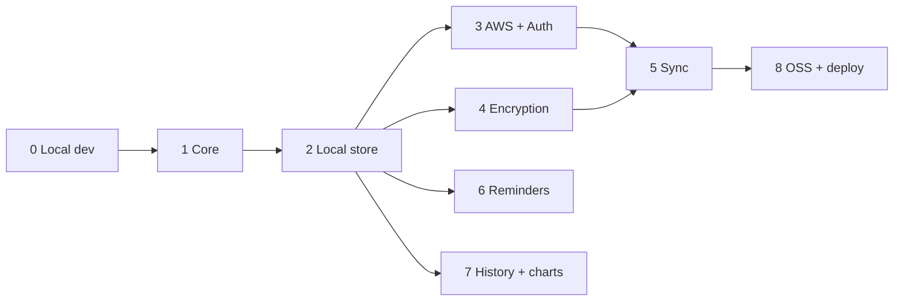

# SteadyDose — Implementation Plan (All Stages)

| | |
|---|---|
| **Working name** | SteadyDose |
| **Method** | Spec-driven development; one spec per stage in `specs/` |
| **Related** | `01-prd.md`, `02-architecture.md` |

---

## How to use this plan
Each stage is independently specifiable and shippable. Work one stage at a time:
1. Open the stage's spec in `specs/`.
2. Hand it to Claude Code as the task, with `02-architecture.md` as shared context.
3. Build to the spec's **acceptance criteria**, with tests, behind the previous stage's output.
4. Commit, review the diff, then move to the next stage.

Do not start a stage before its prerequisites are met. The domain core (Stage 1) is the spine everything else depends on; keep it pure and well-tested.

## Stage map
| # | Stage | Depends on | Key outcome |
|---|---|---|---|
| 0 | Local Development Setup | — | Reproducible dev env + wired app shell, green CI |
| 1 | Foundation & Core Scheduler | 0 | Typed, tested domain core + full UI, in-memory |
| 2 | Local-First Persistence | 1 | Offline-usable single-device app (IndexedDB) |
| 3 | AWS Backend & Auth | 2 | Per-user backend deployable to own account (CDK) |
| 4 | End-to-End Encryption | 2 | On-device encryption + key recovery |
| 5 | Sync Engine | 3, 4 | Encrypted multi-device sync with conflict handling |
| 6 | Reminders & Notifications | 2 | Dose reminders + missed-pattern alerts (PWA) |
| 7 | History & Visualisation | 2 | Charts, adherence, export; blood-level chart via extension |
| 8 | Open-Source Packaging & Deploy | 3,4,5 | One-command BYO-AWS deploy + docs + extension guide |

## Sequencing & milestones
- **Milestone A — Usable offline app (Stages 0–2).** Reproducible dev setup, then the core app and local store. Replaces the spreadsheet on one device. Highest value, lowest risk; ship and dogfood here.
- **Milestone B — Multi-device & private (Stages 3–5).** Cloud backend, encryption, sync. The data-rights goal realised.
- **Milestone C — Daily-driver polish (Stages 6–7).** Reminders and history/visualisation.
- **Milestone D — Release (Stage 8).** Open source with bring-your-own-AWS.

Stages 4 and 6 and 7 can proceed in parallel with the cloud track once Stage 2 lands, if capacity allows; otherwise follow the table order.

## Per-stage summary
0. **Local Development Setup.** Prerequisites and install (Node LTS, Git, Claude Code), repo init, React+TS+Vite scaffold, Tailwind base, PWA baseline, ESLint/Prettier, Vitest, pre-commit hooks, npm scripts, CI, and an empty app shell with one smoke test. Result: a reproducible dev loop that's green in CI, ready for features.
1. **Foundation & Core Scheduler.** On the Stage 0 shell, implement the canonical data model, schedule enumeration, guardrail validation, timezone math, adherence, and the full UI (Today/Schedule/Meds/History) over in-memory state. Define the pharmacology extension interface (no-op default). Hardened, typed, tested version of the prototype.
2. **Local-First Persistence.** Dexie/IndexedDB repository behind the core; load/save; schema + migrations; per-record `updatedAt`/`deleted`. App fully functional offline; survives reload.
3. **AWS Backend & Auth.** CDK stack: Cognito, API Gateway HTTP API, Lambda sync handler, DynamoDB, S3+CloudFront. Auth flow in the client. `/sync/*` endpoints with JWT authorizer (handlers may pass through opaque blobs initially).
4. **End-to-End Encryption.** Crypto module: KDF, envelope keys, AES-GCM record encryption/decryption, passphrase setup/unlock, recovery code, re-wrap on passphrase change. Local store transparently encrypts at rest.
5. **Sync Engine.** Pull/push protocol, change tracking + tokens, offline queue, LWW conflict resolution, tombstones, idempotency. Tighten timezone-robust occurrence matching. End-to-end encrypted multi-device sync.
6. **Reminders & Notifications.** Service-worker notification scheduling for upcoming/adjusted doses; permission UX; zone-aware timing; missed-pattern alerts; documented graceful degradation where background scheduling is limited.
7. **History & Visualisation.** Detailed history, adherence charts, and a blood-level chart that renders the extension's output; JSON/CSV export and import.
8. **Open-Source Packaging & Deploy.** One-command deploy to a fresh account; generated app config; setup/teardown docs; LICENSE; security guidance (SSO/short-lived creds, least privilege); documented extension guide so others plug in their own equations.

## Cross-cutting concerns (apply to every stage)
- **Safety:** the app never originates a dose; guardrails enforced centrally; disclaimers present; clinician validation called out in UI/docs.
- **Privacy:** no telemetry leaves the user's account by default.
- **Testing:** domain core unit-tested; a dedicated **timezone/DST test suite**; sync tests for offline/conflict/idempotency; crypto round-trip and recovery tests.
- **Accessibility:** keyboard nav, visible focus, reduced motion, contrast — maintained throughout.
- **No secrets in code or prompts.**

## Definition of done (per stage)
- All stage functional requirements met and mapped to the PRD FR IDs.
- Acceptance criteria pass as automated tests where feasible.
- No regression in earlier stages.
- Docs/readme updated for anything user-facing or deploy-facing.
