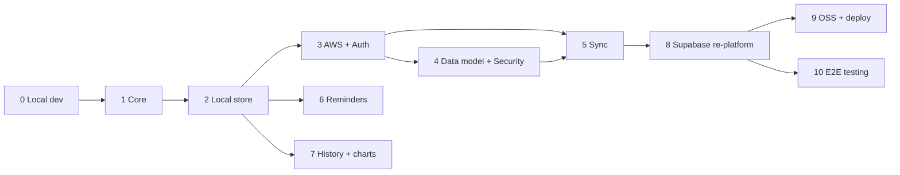

# SteadyDose — Implementation Plan (All Stages)

| | |
|---|---|
| **Working name** | SteadyDose |
| **Method** | Spec-driven development; one spec per stage in `specs/` |
| **Related** | `01-prd.md`, `02-architecture.md` |

---

## How to use this plan
Each stage is independently specifiable and shippable. Work one stage at a time:
1. Open the stage's spec in `specs/`.
2. Hand it to Claude Code as the task, with `02-architecture.md` as shared context.
3. Build to the spec's **acceptance criteria**, with tests, behind the previous stage's output.
4. Commit, review the diff, then move to the next stage.

Do not start a stage before its prerequisites are met. The domain core (Stage 1) is the spine everything else depends on; keep it pure and well-tested.

## Stage map
| # | Stage | Depends on | Key outcome |
|---|---|---|---|
| 0 | Local Development Setup | — | Reproducible dev env + wired app shell, green CI |
| 1 | Foundation & Core Scheduler | 0 | Typed, tested domain core + full UI, in-memory |
| 2 | Local-First Persistence | 1 | Offline-usable single-device app (IndexedDB) |
| 3 | AWS Backend & Auth | 2 | Per-user backend deployable to own account (CDK) |
| 4 | Cloud Data Model & Security Hardening | 3 | Server-readable records + secured (non-zero-knowledge) backend |
| 5 | Sync Engine | 3, 4 | Multi-device sync of readable records with conflict handling |
| 6 | Reminders & Notifications | 2 | Dose reminders + missed-pattern alerts (PWA) |
| 7 | History & Visualisation | 2 | Charts, adherence, export; blood-level chart via extension |
| 8 | Re-platform onto Supabase | 3,4,5 | Drop AWS; Supabase (GoTrue + Postgres + RLS) replaces the custom API tier |
| 9 | Open-Source Packaging & Deploy | 8 | One-command BYO-Supabase deploy + docs + extension guide |
| 10 | End-to-End Testing | 8 | Browser-driven E2E (Playwright) asserting the UI→Supabase round-trip |
| 11 | Logging-Time UX | 1, 2 | Fast custom "time taken" entry: 5-minute steps + quick presets |
| 12 | Next-Dose Override | 1, 2, 4, 5, 8 | One-time, synced override of the next scheduled dose's amount |

## Sequencing & milestones
- **Milestone A — Usable offline app (Stages 0–2).** Reproducible dev setup, then the core app and local store. Replaces the spreadsheet on one device. Highest value, lowest risk; ship and dogfood here.
- **Milestone B — Multi-device & secure (Stages 3–5).** Cloud backend, server-readable data model + security hardening, sync. Private, multi-device, and ready for future server-side features.
- **Milestone C — Daily-driver polish (Stages 6–7).** Reminders and history/visualisation.
- **Milestone D — Re-platform (Stage 8).** Drop AWS; move the cloud onto Supabase (GoTrue + Postgres + RLS), collapsing the custom API tier.
- **Milestone E — Release (Stages 9–10).** Open source with bring-your-own-Supabase, plus a browser-driven E2E suite that proves UI actions reach the Supabase `records` table.

Stages 6 and 7 can proceed in parallel with the cloud track once Stage 2 lands, if capacity allows; otherwise follow the table order. Stage 4 now depends on the Stage 3 backend. The Supabase re-platform (Stage 8) lands after the feature track and **before** open-source packaging (Stage 9), so the released project ships on Supabase, not AWS.

## Per-stage summary
0. **Local Development Setup.** Prerequisites and install (Node LTS, Git, Claude Code), repo init, React+TS+Vite scaffold, Tailwind base, PWA baseline, ESLint/Prettier, Vitest, pre-commit hooks, npm scripts, CI, and an empty app shell with one smoke test. Result: a reproducible dev loop that's green in CI, ready for features.
1. **Foundation & Core Scheduler.** On the Stage 0 shell, implement the canonical data model, schedule enumeration, guardrail validation, timezone math, adherence, and the full UI (Today/Schedule/Meds/History) over in-memory state. Define the pharmacology extension interface (no-op default). Hardened, typed, tested version of the prototype.
2. **Local-First Persistence.** Dexie/IndexedDB repository behind the core; load/save; schema + migrations; per-record `updatedAt`/`deleted`. App fully functional offline; survives reload.
3. **AWS Backend & Auth.** CDK stack: Cognito, API Gateway HTTP API, Lambda sync handler, DynamoDB, S3+CloudFront. Auth flow in the client. `/sync/*` endpoints with JWT authorizer (handlers may pass through opaque blobs initially).
4. **Cloud Data Model & Security Hardening.** Replace opaque envelopes with readable, typed records (`type` + `payload`); shared schema validation reused client + server; server-side ownership/schema enforcement; encryption in transit (TLS) and at rest (KMS); Cognito hardening (password policy, optional MFA, token TTLs); optional on-device cache lock. The cloud is server-readable, **not** zero-knowledge.
5. **Sync Engine.** Pull/push protocol, change tracking + tokens, offline queue, LWW conflict resolution, tombstones, idempotency, server-side validation on push. Tighten timezone-robust occurrence matching. Multi-device sync of readable records.
6. **Reminders & Notifications.** Service-worker notification scheduling for upcoming/adjusted doses; permission UX; zone-aware timing; missed-pattern alerts; documented graceful degradation where background scheduling is limited.
7. **History & Visualisation.** Detailed history, adherence charts, and a blood-level chart that renders the extension's output; JSON/CSV export and import.
8. **Re-platform onto Supabase.** Replace the bring-your-own-AWS stack (Cognito, API Gateway, Lambda, DynamoDB, S3/CloudFront, CDK) with Supabase, collapsing the custom sync API: GoTrue for auth, one Postgres `records` table, per-user isolation via Row-Level Security, incremental pull via PostgREST and a `push_records` RPC carrying the LWW version guard + server-side validation. The domain core, local store, sync engine, record mapping, and UI are unchanged (the swap happens behind existing ports). Local dev becomes a single `supabase start` Docker stack with real GoTrue (no LocalStack/cognito-local split).
9. **Open-Source Packaging & Deploy.** One-command setup to a fresh Supabase project (`supabase link` → `db push`) + static host; generated client config from the project URL + anon key (service-role key never shipped); setup/teardown docs; LICENSE; security guidance (anon-only-in-client, service-role secret, access-token handling); documented extension guide so others plug in their own equations.
10. **End-to-End Testing.** A Playwright suite that drives the real UI in a browser against the local Supabase stack and asserts the resulting rows in the `records` table — proving the full UI → store → sync → `push_records` RPC → Postgres round-trip. Flagship scenario: first-run setup (sign in, create three medications, arrange them into mixed time-slot groups across the day). The Playwright MCP server is registered for interactive UI driving during development.

## Cross-cutting concerns (apply to every stage)
- **Safety:** the app never originates a dose; guardrails enforced centrally; disclaimers present; clinician validation called out in UI/docs.
- **Privacy:** no telemetry leaves the user's account by default.
- **Testing:** domain core unit-tested; a dedicated **timezone/DST test suite**; sync tests for offline/conflict/idempotency; auth/authorization, cross-user isolation, and server-side validation tests; (if used) local-lock round-trip tests.
- **Accessibility:** keyboard nav, visible focus, reduced motion, contrast — maintained throughout.
- **No secrets in code or prompts.**

## Definition of done (per stage)
- All stage functional requirements met and mapped to the PRD FR IDs.
- Acceptance criteria pass as automated tests where feasible.
- No regression in earlier stages.
- Docs/readme updated for anything user-facing or deploy-facing.
