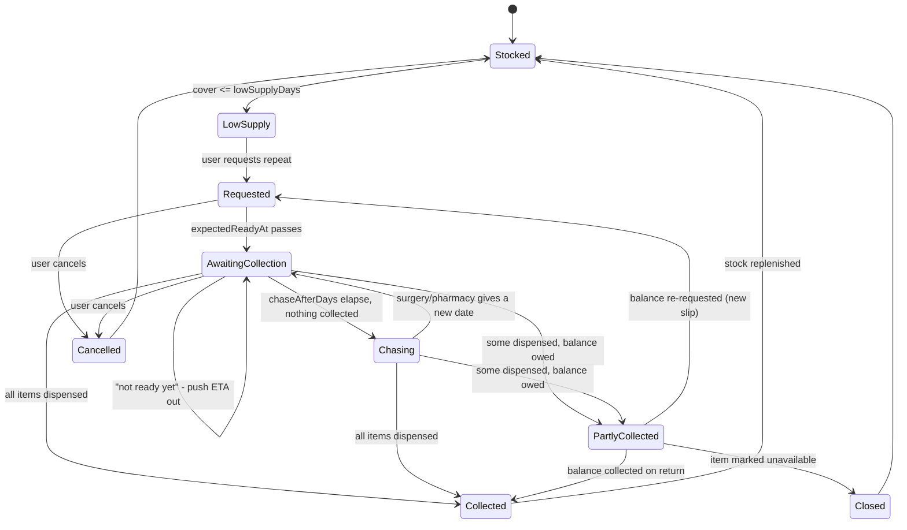

# Stage 27 Spec — Supply Tracking & Repeat Prescriptions

| | |
|---|---|
| **Depends on** | Stage 1 (core + schedule enumeration), Stage 2 (persistence), Stages 4/5/8 (records + sync), Stage 6 (reminders), Stage 18 (assume-taken + schedule snapshots), Stage 22 (`form`/`strength`) |
| **Implements** | FR-27.1 … FR-27.16 · closes **P1 "Refill / supply tracking + low-supply alerts"** (`research/03-feature-list-prioritised-by-category.md` §1) · proposes PRD **FR-SUP-1…5** |
| **Milestone** | Post-release P1 — first P1 stage after the P0 hardening block (22–26) |
| **Status** | Draft |

## 1. Objective

Track **how much of each medication the patient physically has left**, and manage
the **UK repeat-prescription round trip** that replenishes it — including the two
roadblocks that make the real-world process fail:

1. **The pharmacy does not reliably tell you it is ready.** The patient requests a
   repeat, then has to remember, days later and unprompted, to go and collect it.
   The chemist's SMS is best-effort at best. **The app becomes the reliable
   notifier the pharmacy is not.**
2. **The pharmacy does not always have everything.** Items get part-dispensed
   against an *owing slip*, and the patient must return — again, days later,
   unprompted — for the balance.

This is the P1 the research calls "high user value; consistently expected in the
category" (Guava ships pill-count + refill; MyTherapy and Medisafe do not lead with
it). It is also the only feature in the backlog where **failing to act has a hard
clinical consequence** — running out of an anti-epileptic drug is not a missed data
point, it is a missed dose with no recovery path. Adherence tooling that cannot see
an empty box is blind to the most consequential failure mode it has.

> Worked example. Levetiracetam 500 mg, 2 tablets twice daily = 4/day. The patient
> counts 62 tablets on the 1st. On the 12th the app computes 18 tablets left — 4.5
> days of cover, inside the 7-day request lead — and prompts **"Request your repeat
> — you run out on Sat 17th."** They request it from the surgery; the app records
> the request and sets a collection reminder for 3 working days later. On the 15th:
> **"Your repeat should be at the pharmacy — collect it today."** They go. The
> pharmacy has only 28 of the 112 tablets and writes an owing slip for the rest.
> The patient taps **Partly collected → 28 of 112, rest owed, back Friday**. Stock
> rises to 28, the run-out date moves to the 22nd, and a reminder fires Friday:
> **"Collect the 84 tablets the pharmacy owes you."**

## 2. Scope

**In:**

- **Per-medication supply profile** (opt-in per med): the count unit (tablet,
  capsule, mL…), how many dose-units one count-unit carries, the usual quantity
  dispensed per repeat, and the alert thresholds.
- **Derived remaining stock** — an event-sourced count (checkpoint + collections −
  consumption derived from the dose log), never a mutable counter (§5.1).
- **Run-out forecasting** — the date the medication runs out, and days of cover, on
  the user's real schedule (all slots, overrides, snapshot-resolved history).
- **Repeat-prescription requests** covering **one or more medications at once** (a
  single UK repeat slip is typically multi-item), with per-item quantities and
  per-item outcomes.
- **The full round-trip lifecycle** with explicit handling for its roadblocks:
  requested → expected-ready → collect → **fully / partly / not** dispensed →
  owed → returned for the balance → done (§5.3).
- **Four reminder kinds** covering each step, computed in pure core: request-due,
  collect-now, chase, and owed-item-back (§5.5).
- **Learned defaults** — the quantity dispensed per repeat and the surgery's
  turnaround vary between patients but are near-constant *for* a patient, so both
  pre-fill from that medication's history and stay editable per request (FR-27.4).
- Full persistence + cloud sync (two new record types, validator, RLS,
  `push_records`, pgTAP) and JSON/CSV export.

**Out:**

- **Any dose or rationing advice.** The app never suggests stretching supply,
  splitting tablets, skipping, or reprioritising doses when stock is short. It
  reports the number and offers the *administrative* path (request, chase, collect).
  This is the `NFR-Safety` line and it is non-negotiable (§7.1).
- Electronic integration with NHS EPS, GP portals (Patient Access, NHS App, SystmOnline),
  or pharmacy APIs. The user tells the app what they did; the app does not transact.
  A deep-link to a user-configured URL is the most that is in scope (FR-27.15).
- Barcode/pack scanning to seed a count (P2, `research/03` §1).
- Multi-patient / caregiver supply views (P2 profiles).
- Bank-holiday calendars for working-day arithmetic (§7.3).
- Cost, prescription charges, PPC tracking.

## 3. Prerequisites

- `core/schedule.ts` occurrence enumeration and `core/scheduleHistory.ts` snapshot
  resolution — consumption is derived from resolved occurrences, so it inherits
  correct historical regimens for free.
- `core/adherence.ts` assume-taken resolution (Stage 18 FR-18.6).
- `core/reminders.ts` (`ScheduledReminder`, `ReminderKind`, `ReminderPrefs`) — the
  new kinds extend this rather than introducing a parallel mechanism.
- `core/cloudRecord.ts` `RecordType` union + `supabase/migrations` `validate_record`.

## 4. Data model

Additive. Two new record types; one optional field on `Medication`.

### 4.1 Supply profile (rides on `Medication`)

```ts
/** What the patient physically counts. Defaults from `Medication.form`. */
export type CountUnit = 'tablet' | 'capsule' | 'mL' | 'patch' | 'drop' | 'dose' | 'unit';

export interface SupplyProfile {
  countUnit: CountUnit;
  /**
   * Dose-units carried by one count-unit — e.g. 500 for a 500 mg tablet, so a
   * 1000 mg dose consumes 2 tablets. The numeric companion to Stage 22's
   * free-text `strength`; never derived from it by parsing (FR-27.2).
   */
  doseUnitsPerCount: number;
  /** Usual quantity dispensed per repeat; pre-fills each request (FR-27.4). */
  usualQuantity?: number;
  /** Warn when cover falls to this many days. Default 14. */
  lowSupplyDays: number;
  /** Days the request→in-your-hand round trip takes. Default from Settings. */
  requestLeadDays: number;
}

// On Medication — absent = this medication is not supply-tracked at all.
supply?: SupplyProfile;
```

Absence is the back-compatible default: a medication with no `supply` is invisible
to every part of this stage — no counts, no forecasts, no reminders, no rows in the
requests UI. Tracking is opt-in per medication (FR-27.1).

### 4.2 `SupplyCount` — a physical count checkpoint

```ts
export interface SupplyCount {
  id: string;
  medId: string;
  countedAt: Instant;   // when the patient counted
  zone: IanaZone;
  quantity: number;     // count-units actually in hand at countedAt
  note?: string;
  updatedAt: Instant;
  version?: number;
  deleted?: boolean;
}
```

### 4.3 `PrescriptionRequest` — one repeat slip, one or more medications

```ts
export type PrescriptionItemStatus =
  | 'pending'      // not yet collected
  | 'dispensed'    // fully collected
  | 'owed'         // part-dispensed (or none), pharmacy owes the balance
  | 'unavailable'; // not supplied and not owed — line closed (discontinued, gave up)

export interface PrescriptionItem {
  medId: string;
  requestedQuantity: number;      // count-units asked for
  collectedQuantity: number;      // cumulative actually received (starts 0)
  status: PrescriptionItemStatus;
  /** Set when `owed`: when the pharmacy said to come back. Drives the reminder. */
  expectedBackAt?: Instant;
  note?: string;                  // e.g. "owing slip #4412"
}

export type PrescriptionStatus =
  | 'requested'            // sent to the surgery, nothing collected
  | 'awaiting-collection'  // past the expected-ready date, still uncollected
  | 'partially-collected'  // some dispensed, at least one item owed
  | 'completed'            // every item terminal (dispensed | unavailable)
  | 'cancelled';

export interface PrescriptionRequest {
  id: string;
  requestedAt: Instant;
  zone: IanaZone;
  items: PrescriptionItem[];      // >= 1
  /** When the script is expected to be collectable. Derived at creation from the
   *  turnaround setting, then user-adjustable ("they said Thursday"). */
  expectedReadyAt: Instant;
  /** Free text: "Patient Access", "phoned the surgery", "paper slip". */
  channel?: string;
  cancelledAt?: Instant;
  note?: string;
  updatedAt: Instant;
  version?: number;
  deleted?: boolean;
}
```

`PrescriptionStatus` is **derived** by pure core from the items and `now`, not
stored — there is no status field to drift out of agreement with the items
(FR-27.7). `cancelledAt` is the single exception, because cancellation is a fact
about the world, not a function of the items.

### 4.4 Settings

```ts
supplyDefaults?: {
  /** Working days from request to collectable. Default 3. */
  turnaroundWorkingDays: number;
  /** Days after `expectedReadyAt` with nothing collected before chasing. Default 2. */
  chaseAfterDays: number;
  /** Default `lowSupplyDays` for newly tracked meds. Default 14. */
  lowSupplyDays: number;
  /** Optional deep-link to the user's repeat-request service (FR-27.15). */
  requestUrl?: string;
};
```

Optional for back-compat; read with defaults. `ReminderPrefs` gains a
`supplyEnabled: boolean` (default `true` when reminders are on) and stays
**device-local and unsynced**, matching Stage 6 — the *supply state* syncs, the
*notification preference* does not.

### 4.5 Sync

`RecordType` gains `'supplyCount'` and `'prescriptionRequest'`; `RECORD_TYPES`,
the `cloudRecord` validator dispatch table, the Dexie schema, `Dataset`, and the
SQL `validate_record` each gain the two entries. No new table, no migration of
existing rows — same single-`records` shape as every other entity.

## 5. Functional requirements

### 5.1 Stock is derived, never decremented

- **FR-27.1** — Supply tracking is **opt-in per medication** via `SupplyProfile`.
  Untracked medications behave exactly as today, everywhere.

- **FR-27.2** — `doseUnitsPerCount` is entered explicitly by the user. The app MUST
  NOT infer it by parsing Stage 22's free-text `strength` ("500 mg", "5 mg/mL"), and
  MUST NOT let a supply figure feed any dose value. Supply arithmetic is one-way:
  doses determine consumption; consumption never determines a dose.

- **FR-27.3** — Remaining stock for a medication at instant `t` is **computed**:

  ```
  remaining(med, t) = latestCount.quantity
                    + Σ collections strictly after latestCount.countedAt, up to t
                    − Σ consumption in (latestCount.countedAt, t]
  ```

  where `latestCount` is the most recent non-deleted `SupplyCount` for that med.
  **There is no stored running total.** This is a correctness requirement, not a
  style preference: the sync model is last-write-wins per record (FR-SYNC-3), and a
  mutable counter decremented on two devices loses one device's decrements
  silently. Every input above is an immutable-in-practice event, so LWW is safe and
  the count is identical on every device.

  It also self-heals: correcting a dose logged last week — or flipping an
  assumed-taken dose to missed — re-derives today's stock with no reconciliation
  step, because nothing was ever written down.

- **FR-27.4** — Consumption of one occurrence is `dose / doseUnitsPerCount`
  count-units, summed over **resolved** occurrences in the window:
  - **taken** (genuinely logged *or* assumed-taken per FR-18.6) → consumes;
  - **skipped**, **missed** → consumes nothing;
  - **due** / **upcoming** → nothing (they have not happened).

  Genuinely-logged entries are attributed at `actualInstant` (when the tablet left
  the pack); assumed-taken occurrences at `scheduledInstant`. Consumption sums
  across **all** slots containing the medication (FR-SCH-3), honours `DoseOverride`
  amounts (Stage 12), and resolves historical days through `ScheduleSnapshot`s — all
  inherited by deriving from occurrences rather than re-implementing enumeration.

- **FR-27.5** — Fractional consumption is exact in arithmetic and rounded only for
  display. If a medication's scheduled doses are not whole multiples of
  `doseUnitsPerCount`, the profile editor warns once (a half-tablet regimen is legal
  and common; a 0.37-tablet dose is a data-entry error worth flagging) but never
  blocks.

- **FR-27.6** — **Forecast.** `projectSupply(dataset, medId, now, zone)` returns
  `{ remaining, runsOutOn: ISODate | null, daysOfCover: number | null }` by walking
  future planned occurrences forward against remaining stock. `null` means
  "unbounded within the horizon" (no scheduled doses, or cover beyond the 180-day
  cap). Pure, deterministic, zone-aware, unit-tested.

### 5.2 The repeat-prescription round trip

- **FR-27.7** — A `PrescriptionRequest` covers **one or more** medications in one
  record, because one UK repeat slip does. Its `PrescriptionStatus` is derived, not
  stored:

  | Derived status | Condition |
  |---|---|
  | `cancelled` | `cancelledAt` set |
  | `completed` | every item `dispensed` or `unavailable` |
  | `partially-collected` | any item `owed` |
  | `awaiting-collection` | any item `pending` and `now > expectedReadyAt` |
  | `requested` | otherwise |

- **FR-27.8** — Creating a request pre-fills each item's `requestedQuantity` from
  that medication's `usualQuantity`, falling back to the most recent
  `collectedQuantity` for it, falling back to blank — the "different patients get
  different amounts, but a given patient's amounts are consistent" property. Every
  value stays editable, and the request screen pre-selects **every tracked
  medication at or below its low-supply threshold**, so the common case (request
  everything that's running low, together) is one confirmation.

- **FR-27.9** — `expectedReadyAt` is seeded as `requestedAt +
  turnaroundWorkingDays` (Mon–Fri arithmetic, §7.3) and is **directly editable** —
  when the surgery or pharmacy names a day, that beats the default.

- **FR-27.10** — **Collection outcomes.** From a request the user records, per item,
  one of:
  - **Collected in full** → `collectedQuantity = requestedQuantity`, `dispensed`.
  - **Part-collected** → enter the quantity actually received; the balance becomes
    `owed` with an optional `expectedBackAt` ("they said Friday"). Partial
    collection is a **first-class outcome, not an error state** — it is routine.
  - **Nothing today** → stays `pending` (still not ready) or becomes `owed` (they
    have none, come back).
  - **Not available** → `unavailable`, closing the line without an owed balance.

  Collecting the balance later adds to `collectedQuantity` and flips the item to
  `dispensed`; the stock rise is immediate via FR-27.3, with no separate count.

- **FR-27.11** — A part-collected item MAY be **split off into a new request** in one
  action, for when the pharmacy tells the patient to re-request from the surgery
  rather than holding an owing. The original item closes as `unavailable` with a
  note, and the new request carries the outstanding quantity.

- **FR-27.12** — Every state change is **user-initiated and reversible**. The app
  never infers that a prescription was collected, never auto-completes on a date,
  and never marks an item dispensed because its expected date passed. Editing a past
  collection re-derives stock (FR-27.3) with no migration.

### 5.3 Lifecycle



### 5.4 User flow

**A — Turn on tracking (once per medication).** Meds → a medication → **Track
supply**. The count unit is pre-selected from Stage 22's `form` (`tablet` → tablets,
`liquid` → mL). The user enters dose-units per count-unit ("each tablet is `500` mg")
and the usual quantity per repeat ("`112`"). The panel immediately shows the derived
daily rate ("you use 4 tablets/day — a repeat lasts about 28 days"). One field left:
**how many do you have right now?** — which writes the first `SupplyCount`.

**B — Running low.** Supply appears on the medication and in a **Supply** card on
Today, showing remaining, days of cover, and the run-out date. When cover falls to
`lowSupplyDays`, a **request-due** reminder fires: _"Levetiracetam — 4 days left,
you run out Sat 17 Aug. Request your repeat."_ Tapping it opens the request sheet.

**C — Request.** The sheet lists every tracked medication at or below threshold,
pre-ticked, each with its usual quantity pre-filled and editable; the user can tick
in anything else (the "while I'm at it" case that matches how repeats are actually
ordered). Optional channel note and a deep-link button to the user's repeat service
(FR-27.15) — the app records the request, it does not submit it. Confirming writes
the `PrescriptionRequest` and shows: _"Requested. Expect it at the pharmacy from
Thu 15 Aug — we'll remind you."_

**D — The collection gap (the reason this stage exists).** On `expectedReadyAt` a
**collect-now** reminder fires: _"Your repeat should be ready — collect from the
pharmacy today (Levetiracetam, Lamotrigine)."_ This is the notification the chemist
does not reliably send, and it is generated from state the app already holds, with
no dependency on anyone else's SMS. Two taps on the reminder: **Collected** →
flow E; **Not ready yet** → pick a new date, ETA moves out, reminder re-arms.

**E — Collect.** The collection sheet lists the request's items, each defaulting to
*collected in full*. Full collection is one tap. Per item the user can switch to:

- **Part-collected** — enter what they actually got ("28 of 112"); the balance
  becomes owed, with an optional back-on date.
- **Nothing today** — still not ready, or the pharmacy has none (→ owed).
- **Not available** — closes the line.

Saving replenishes stock and re-forecasts every affected medication immediately.

**F — Owings.** A part-collected request stays open on the Supply screen as
_"Pharmacy owes you 84 tablets of Levetiracetam — back Fri 16 Aug"_, and an
**owed-item** reminder fires on that date: _"Collect the 84 tablets the pharmacy
owes you."_ Collecting the balance closes the item; the user can also push the date
out, or split the balance into a fresh request (FR-27.11).

**G — Chasing.** If `chaseAfterDays` pass beyond `expectedReadyAt` with nothing
collected, a **chase** reminder fires: _"Your repeat still isn't collected — 6 days
since you requested it. Chase the surgery or pharmacy?"_ — with **Got a new date**,
**Collected**, and **Cancel request** actions. This covers the silent-failure case
where the surgery never issued the script at all.

**H — Recount.** **Recount stock** on any tracked medication writes a new
`SupplyCount`, superseding everything before it. This is the escape hatch for
drift — a dose taken from an old pack, tablets dropped, a spare box found — and
needs no reconciliation, because stock is derived from the latest count forward.

### 5.5 Reminders

- **FR-27.13** — `ReminderKind` gains `'supply-request'`, `'supply-collect'`,
  `'supply-chase'`, `'supply-owed'`. A pure
  `computeSupplyReminders(dataset, now, zone, prefs)` returns `ScheduledReminder`s
  with stable dedupe ids (the existing contract), fired by the same service-worker
  path as dose reminders and inheriting Stage 25's delivery and escalation work.

  | Kind | Fires when | Cleared by |
  |---|---|---|
  | `supply-request` | cover ≤ `lowSupplyDays` and no open request covers that med | opening a request, or stock rising |
  | `supply-collect` | `now >= expectedReadyAt`, items still `pending` | collection, new ETA, or cancellation |
  | `supply-chase` | `now >= expectedReadyAt + chaseAfterDays`, nothing collected | any collection, new ETA, or cancellation |
  | `supply-owed` | `now >= item.expectedBackAt` for an `owed` item | collecting the balance, closing the line, or a new date |

- **FR-27.14** — Supply reminders carry **no dose value** and never fire at dose
  times. A medication running out MUST NOT suppress, delay, or alter its dose
  reminders — the two systems are independent, and an empty box is a reason to
  notify *more*, never less.

- **FR-27.15** — The request sheet MAY open a user-configured `requestUrl` (NHS App,
  Patient Access, SystmOnline, a pharmacy site). The app opens the link and records
  what the user says they did. It transmits nothing and integrates with nothing.

- **FR-27.16** — Supply and prescription data is included in JSON export/import
  (round-tripping exactly) and in CSV export as its own section, and the Stage 23
  medication list MAY show current cover per medication — useful at an appointment
  when the conversation is "are you due a review?". The pre-visit summary stays
  clinical and does **not** include stock levels.

## 6. Acceptance criteria

- **AC1** — A medication with no `supply` profile loads, renders, syncs, and
  exports exactly as before, and appears nowhere in the supply UI. A pre-Stage-27
  dataset upgrades with no loss (mutation-proven against the loader).
- **AC2** — Given a checkpoint of 62 tablets and a 4/day regimen, `remaining` after
  10 days is 22; after logging one of those doses as **skipped**, 23; after adding a
  collection of 112 on day 5, 134 on day 10. Pure-core, unit-tested.
- **AC3** — Two devices offline: device A records a collection, device B records a
  different collection, both sync. Final stock on both devices reflects **both**
  collections — proving the derived model survives LWW where a counter would not.
- **AC4** — `projectSupply` returns the correct `runsOutOn` for: multi-slot meds,
  a `DoseOverride` in the window, a regimen changed mid-window (snapshot-resolved),
  and a DST transition day. Covered by the timezone suite.
- **AC5** — Requesting a repeat pre-selects every med at/below threshold with
  quantities pre-filled from `usualQuantity`, then from last collected, then blank.
- **AC6** — Recording "28 of 112 collected, rest owed, back Friday" sets the item to
  `owed` with balance 84, derives the request as `partially-collected`, raises stock
  by 28 immediately, moves the run-out date, and schedules a `supply-owed` reminder
  for Friday. Collecting the balance closes the item and derives `completed`.
- **AC7** — With a request outstanding past `expectedReadyAt`, a `supply-collect`
  reminder fires; **Not ready yet** with a new date re-arms it and fires no
  duplicate. Past `chaseAfterDays`, `supply-chase` fires. Both stop on collection
  and on cancellation. Dedupe ids are stable across recomputes.
- **AC8** — Supply state **never** alters an adherence figure, a dose reminder, a
  planned dose, or an occurrence status: an adherence/reminder fixture computed with
  supply tracking on is byte-identical to the same fixture with it off.
- **AC9** — No user-facing string in the feature suggests changing, splitting,
  delaying, or skipping a dose in response to low stock; copy is reviewed against
  §7.1 and asserted by test.
- **AC10** — pgTAP: a valid `supplyCount` and `prescriptionRequest` pass
  `validate_record`; malformed payloads (negative quantity, empty `items`,
  `collectedQuantity > requestedQuantity`, unknown item status) are rejected; RLS
  isolates both types per user. Sync round-trips both.
- **AC11** — JSON export/import round-trips counts, requests, and profiles exactly;
  CSV includes the supply section.
- **AC12** — `src/core` boundary intact: all arithmetic, derivation, forecasting,
  status derivation, and reminder computation live in `core/supply.ts` with no
  React/store imports.

## 7. Design decisions (settled here, not in chat)

**7.1 Safety — the hard line.** Low stock produces exactly two kinds of output: a
**number** (what you have, how long it lasts, when it runs out) and an
**administrative prompt** (request, chase, collect, return). It never produces a
dosing suggestion. "Take 1 instead of 2 to make it last", "skip tonight's dose",
"prioritise the morning dose" — all prohibited, in copy and in logic. The app has no
clinical basis for rationing advice and offering it would cross the
regulated-clinical-decision-support line the product deliberately stays behind
(`NFR-Safety`, `research/03` cross-cutting guardrail). Running short is a **supply
problem with an administrative fix**, and the app's job is to surface it early
enough that the administrative fix works.

**7.2 Why derived, not a counter.** Settled in FR-27.3: a decrementing counter is
unsafe under last-write-wins sync and unrecoverable after any correction to
historical dose data. The chosen model costs a recomputation on read and buys
device-agnostic correctness, free self-healing, and no reconciliation code. The
cost is bounded — consumption is derived from occurrence enumeration that already
runs for Today and adherence, over a window that starts at the latest checkpoint.

**7.3 Working days.** `turnaroundWorkingDays` counts Mon–Fri and skips weekends,
because "3 working days" is how UK surgeries actually quote it. **Bank holidays are
out of scope** — no calendar is bundled and none is fetched (that would mean a
network dependency in a local-first app). The user can always edit
`expectedReadyAt` directly, which is the honest escape hatch, and the chase reminder
catches a holiday-delayed script anyway.

**7.4 Assumed-taken doses consume stock.** With `assumeTakenOnTime` on (the default,
settled in Stage 18 §7.1), an unlogged past dose is assumed taken — so it must be
assumed consumed. Any other choice makes stock drift upward for exactly the
low-engagement users this feature protects. If the user later corrects the dose,
stock re-derives (FR-27.3). This is the only defensible reading: the same policy
governs adherence and supply, so the two can never contradict each other.

**7.5 One request, many medications.** Modelling a request as multi-item rather than
per-medication matches the paper slip, keeps one reminder for one trip to the
pharmacy (rather than four notifications for four medications collected in one
visit), and makes partial dispensing representable, which is the whole point.

## 8. PRD amendment (proposed)

Add to `specs/01-prd.md` §6 — the FRs this stage implements:

- **FR-SUP-1.** Optional per-medication supply tracking: count unit, dose-units per
  count-unit, usual dispensed quantity, alert thresholds.
- **FR-SUP-2.** Remaining stock is derived from a physical-count checkpoint plus
  recorded collections minus consumption resolved from the dose log; never a stored
  counter.
- **FR-SUP-3.** Forecast run-out date and days of cover from the user's real
  schedule, zone-aware.
- **FR-SUP-4.** Record repeat-prescription requests covering one or more
  medications, through request → expected-ready → full/partial/failed collection →
  owed balance → completion, with every transition user-initiated and reversible.
- **FR-SUP-5.** Reminders for: request due, collection due, chase an uncollected
  request, and return for an owed item. Supply reminders never carry a dose value
  and never alter dose reminders or adherence.

Add to §5 user stories:

- **US11.** As a patient, I know how many tablets I have left and when I run out, so
  I can request a repeat before it becomes urgent.
- **US12.** As a patient, the app reminds me to collect my prescription, because the
  pharmacy often doesn't.
- **US13.** As a patient, when the pharmacy only has part of my prescription, I
  record what I actually got and get reminded to go back for the rest.

## 9. Open questions

1. **Where does supply live in the IA?** A dedicated **Supply** screen, or a card on
   Today plus a section in each medication's detail? Leaning: card on Today (that is
   where the urgency belongs) + per-med detail, with a full screen only if open
   requests and owings need somewhere to live. Settle during implementation, in this
   spec.
2. **Should a request auto-close after N months?** A forgotten `requested` record
   nags indefinitely via `supply-chase`. Options: cap chase reminders at a count
   (leaning — consistent with Stage 25's bounded escalation) or auto-cancel after a
   long timeout (rejected as inference; FR-27.12 forbids it).
3. **Liquids and mL.** `doseUnitsPerCount` for a liquid is dose-units per mL, so a
   5 mg/mL suspension at a 15 mg dose consumes 3 mL — the arithmetic holds, but the
   count is a **volume estimate**, not a count, and drifts faster. Confirm whether
   the profile editor should say so, and whether liquids should default to a shorter
   recount prompt.
4. **Multi-pack rounding.** Dispensing is usually in whole packs (a "112" is
   4×28), so a pharmacy short-supplying often gives whole packs. Worth offering a
   `packSize` to make part-collection entry "2 of 4 boxes" instead of "56 of 112"?
   Deferred — additive, and only justified if the quantity entry proves fiddly in
   real use.
